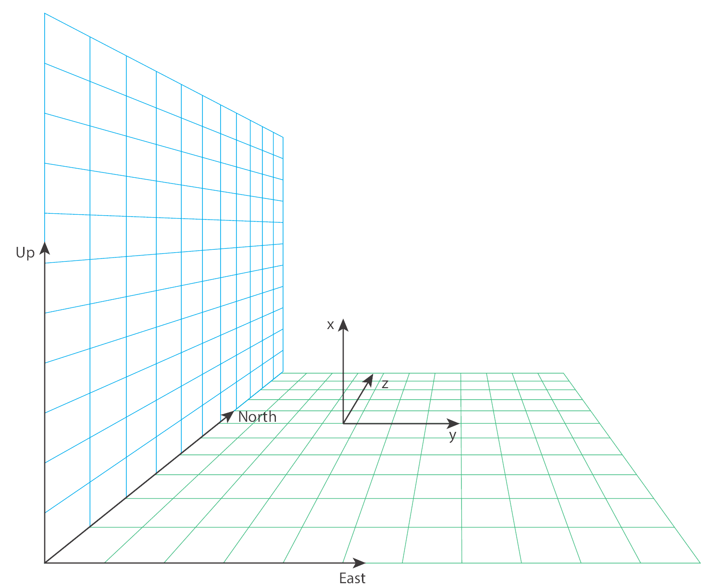
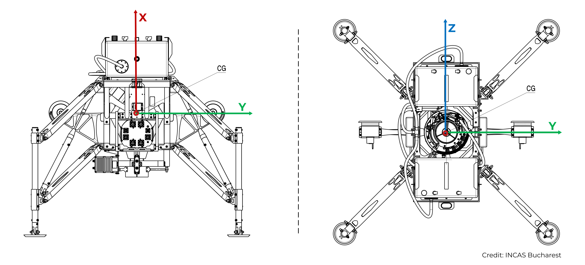

# mBox User Manual 
v$TKN_VERSION

- [Introduction](#introduction)
- [Initial setup](#initial-setup)
    - [Package contents](#package-contents)
    - [Physical mounting](#physical-mounting)
    - [Credentials](#credentials)
    - [Network](#network)
    - [Network Time Protocol Configuration](#network-time-protocol-configuration)
- [Execution](#execution)
    - [Mission parameters](#mission-parameters)
    - [Logs](#logs)
- [Software Updates](#software-updates)
- [Input / Outut Interface](#input--outut-interface)
    - [Reference frames](#reference-frames)
    - [Input signals received by the mBox](#input-signals-received-by-the-mbox)
    - [Output signals transmitted by the mBox](#output-signals-transmitted-by-the-mbox)
- [Error codes](#error-codes)

## Introduction 
The mBox is a Payload Application Computer (PAC) developed by Embotech AG to run their Onboard Real-Time Trajectory Optimization (OBRTTG) software.

The mBox can be split in two main components: the hardware platform and the software running running on it.

The hardware platform is integrated by:
- Embedded computation board Raspberry Pi 4 (4GB model) based on o ARM Quad-Core A72. The operating system is Ubuntu 20.04.3 LTS (Focal Fossa) with `5.4.0-1056-raspi` Linux kernel.
- 1600mAh battery connected via the PiJuice HAT power supply.
- Active cooling system fan connected to the Raspberry Pi via the IO pins.
- Enclousure tailored with the size and openings required by the application.

The software is shipped as a compressed `.zip` file with the contents below:

- `mbox-obrttg-software` Main mBox program running the Onboard Real-Time Trajectory Optimization (Obrttg) software
- `doc` Folder containing the mBox documentation regarding initial setup, software execution, I/O interface, error codes.
    - `README.html` Documentation in `html` format.
    - `README.md` Documentation in `markdown` format.
    - `assets` Images required by the documentation files.

## Initial setup 
### Package contents
The delivired physical package contains the following items:
- mBox hardware platform as detailed in the [Introduction](#introduction) section.
- Raspberry Pi 4 charger.
- USB-C to micro-USB adapter
- Adhesive velcro straps for mounting.

<p align="center">

</p>
<p align="center">
Figure 1 - Package contents
</p>

### mBox hardware handling
The mBox case has two parts: bottom and top. The two parts are attached two each other through 4 snap points. To open the case, gently press on the sides of bottom part and pull the top part.

The mBox receives power from either the battery or a 5VDC 3A power adapter (included in the package) connected to the micro-USB port. Once the mBox is connected to power, open the mBox case and press the button marked on the picture below.

<p align="center">

</p>
<p align="center">
Figure 2 - mBox power button
</p>

### Physical mounting
The mBox enclousure is 3D printed in PLA. To prevent the deformation of the enclousure, the mBox should be placed in a location where the continuous temperature is no higher than 50ºC. It is up to the user to decide how to securely attach the mBox ot its final mounting location.

A flexible option to mount the mBox to the flying platform is using the adhesive velcro straps included in the package.

### Network
In order to communicate with the Onboard Computer (OBC) the mBox needs to be connected via Ethernet to the LAN where the OBC is. The mBox's IP address and gateway can be configured in the file `/etc/netplan/50-cloud-init.yaml`

```yaml
# This file is generated from information provided by the datasource.  Changes
# to it will not persist across an instance reboot.  To disable cloud-init's
# network configuration capabilities, write a file
# /etc/cloud/cloud.cfg.d/99-disable-network-config.cfg with the following:
# network: {config: disabled}
network:
    ethernets:
        eth0:
            dhcp4: false
            addresses: [123.456.0.184/12]
            gateway4: 123.456.0.1
            nameservers:
                addresses: [8.8.8.8, 1.1.1.1]
            optional: true
    version: 2
```

Then run `sudo netplan apply` (or `sudo netplan --debug apply`) to apply the changes.

### Network Time Protocol Configuration
The OBC and mBox real-time clocks are synchronized via NTP. The NTP configuration file on the mBox can be found in `/etc/ntp.conf`. In order for the configuration to work in a different setup, the OBC and host machine IPs may need to be adjusted.
```bash
# mBox NTP Configuration
#
# This configuration file (usually stored under /etc/ntp.conf or
# defined with ntpd -c <location>) is read when the ntp deamon `ntpd`
# is started.
#
# NTP Configuration File Manual:
#       https://docs.ntpsec.org/latest/ntp_conf.html
#
# Servers:
#       INCAS Host Machine      123.456.1.27
#       INCAS OBC               123.456.0.169
#
# Tools:
#       ntpq -p                 Prints systems current time status
#       ntpdc -c loopinfo       Prints systems offset in seconds
#
# Note:
#       If configuration has been changed, restart the ntp service
#               sudo /etc/init.d/ntp restart
#
# (c) 2013-2022 Embotech AG

# INCAS Host PC
# iburst:       When the server is unreachable, send a burst of six packets
#               instead of the usual one. This is designed to speed the initial
#               synchronization acquisition with the server command.
# prefer:       Marks server as preferred
server 123.456.1.27 iburst minpoll 4 maxpoll 6 prefer

# INCAS OBC (eSVF Subnet)
server 123.456.0.169 iburst

# File to record the frequency of the local clock oscillator. If this file
# exists the deamon will use this frequency as initial frequency instead of 0
driftfile /var/lib/ntp/ntp.drift

# Specifying minimum and maximum poll interval for NTP messages
# defined as a power of 2 in seconds, i.e 4 means 16s or 6 means 64s
# DEFAULT: maxpoll 10
minpoll 4
maxpoll 6

# Restrict access to ntp deamon
# exchaneg time with everybody, but don't allow configuration changes
# # default:  prevent access to everything not explicitly allowed
# # kod:      Kiss-o'-death packet is to be sent to reduce unwanted queries
# # nomodify: prevents changes to configuration file
# # notrap:   prevents ntpdc control message protocol traps
# # nopeer:   prevents peer associations being formed
# # noquery:  prevents ntpq and ntpdc queries but not time queries being answered
# # -6:       is required before an IPv6 address
restrict default kod nomodify notrap nopeer noquery
restrict -6 default kod nomodify notrap nopeer noquery

# Local users may interrogate the ntp server more closely
# Needed since some local processes or applications need access to the
# standard loopback address which is prevented by restrict default
restrict 127.0.0.1
restrict ::1

# Allow hosts from the local network
restrict 123.456.0.0 mask 255.255.255.0 nomodify notrap nopeer

# Prevent NTP from stepping
# tinker step <seconds>         if set to 0 no clock adjustments/jumps will occur
#                               default 0.128
#tinker step 0


###############################################################################
# Other Default Conifg Options
###############################################################################

# Leap seconds definition provided by tzdata
#leapfile /usr/share/zoneinfo/leap-seconds.list

# Enable this if you want statistics to be logged.
#statsdir /var/log/ntpstats/

#statistics loopstats peerstats clockstats
#filegen loopstats file loopstats type day enable
#filegen peerstats file peerstats type day enable
#filegen clockstats file clockstats type day enable

# Access control configuration; see /usr/share/doc/ntp-doc/html/accopt.html for
# details.  The web page <http://support.ntp.org/bin/view/Support/AccessRestrictions>
# might also be helpful.
#
# Note that "restrict" applies to both servers and clients, so a configuration
# that might be intended to block requests from certain clients could also end
# up blocking replies from your own upstream servers.

# Needed for adding pool entries
#restrict source notrap nomodify noquery

# Clients from this (example!) subnet have unlimited access, but only if
# cryptographically authenticated.
#restrict 123.456.123.0 mask 255.255.255.0 notrust


# If you want to provide time to your local subnet, change the next line.
# (Again, the address is an example only.)
#broadcast 123.456.123.255

# If you want to listen to time broadcasts on your local subnet, de-comment the
# next lines.  Please do this only if you trust everybody on the network!
#broadcastclient
#disable auth
```

On the OBC side, the tested NTP configuration file has the following content:
```conf
# The driftfile  - it records the machine specific clock error
driftfile /var/lib/ntp/drift

# INCAS Host PC
server 123.456.1.27 iburst

# Using local hardware clock as fallback
server 127.127.1.0
fudge 127.127.1.0 stratum 10

# Defining a default security setting
restrict default

# Allow hosts from local network
restrict 123.456.0.0 mask 255.255.0.0 nomodify notrap nopeer
```

After any changes on the `ntp.conf` files, the NTP server needs to be restarted with `/etc/init.d/ntpd restart`.

One can check that the mBox can actually use NTP daemon on the OBC as a server with the command `ntpdate -d 123.456.0.169` (or the corresponding OBC IP). If successful, the output should look like the one below
```shell
mbox@ubuntu:~$ ntpdate -d 123.456.0.169
23 Mar 07:03:56 ntpdate[71312]: ntpdate 4.2.8p12@1.3728-o (1)
Looking for host 123.456.0.169 and service ntp
host found : 123.456.0.169
transmit(123.456.0.169)
receive(123.456.0.169)
transmit(123.456.0.169)
receive(123.456.0.169)
transmit(123.456.0.169)
receive(123.456.0.169)
transmit(123.456.0.169)
receive(123.456.0.169)

server 123.456.0.169, port 123
stratum 11, precision -22, leap 00, trust 000
refid [127.127.1.0], root delay 0.000000, root dispersion 0.011002
transmitted 4, in filter 4
reference time:    e5e544dc.6de75f6f  Wed, Mar 23 2022  7:03:56.429
originate timestamp: e5e544e2.aeb5ec4d  Wed, Mar 23 2022  7:04:02.682
transmit timestamp:  e5e544e2.ae8a8d4d  Wed, Mar 23 2022  7:04:02.681
filter delay:  0.02635  0.02615  0.02623  0.02605
         0.00000  0.00000  0.00000  0.00000
filter offset: -0.00007 -0.00002 -0.00005 0.000035
         0.000000 0.000000 0.000000 0.000000
delay 0.02605, dispersion 0.00005
offset 0.000035
```

## Execution
Once the preliminary setup is completed, the mBox software can be executed.

- `ssh` into the mBox with the provided credentials

    ```
    ssh mbox@123.456.0.184
    ```
- Navigate to the `obrttg` directory

    ```
    cd obrttg
    ```
- Run the mBox main program

    ```
    ./mbox-obrttg-software
    ```

After a successful initialization, the output should look like the one below. 
```shell
mbox@ubuntu:~$ ./mbox-obrttg-software
[obrttg-sw] Preliminary checks
[obrttg-sw] Time synchronization ...  waiting for time to sync, please wait
        [NTP] Max. Err: 26756 us
        [NTP] Est. Err: 15 us
        [NTP] Offset:   16622 ns and not us
        [NTP] Synchronized:  YES (1)
. [OK]
[obrttg-sw] Configuration
[obrttg-sw]   initialize() ... [OK]
[obrttg-sw]   start() ...
```
In the event of any error during the initialization, the return code will be printed. A list of all the possible error codes is included in the [Error Codes](#error-codes).

After a successful initialization, the mBox software remains idle until the OBC starts communicating with the mBox. At this point, the mBox software will run until the mission is completed.
```shell
```

### Mission parameters
The mBox mission parameters are stored as a `.json` file in `~/obrttg/params.json`. The mBox has a
```json
{
    "retargetingEventTime": 82,                                 /* [s] Time at which the end target change is triggered */
    "trackingErrorThreshold": 2,                                /* [m] Maximum deviation from the trajectory before recomputing */
    "takeOffHeight": 2,                                         /* [m] Height at which the optimal guidance takes over */
    "verticalTakeOffVelocity": [0,0,0],                         /* [m/s] Vehicle velocity when the optimal guidance takes over */
    "offlineOtpGeneration": false,                              /* [-] [Not-enabled] Pre-compute trajectories while on-site */
    "launchPadPosition": [0,0,0],                               /* [m] Launchpad position */
    "maxSpeedConstraint": 1.1,                                  /* [m/s] Maximum allowed velocity norm */
    "tiltAngleConstraint": 0.26179938779914941,                 /* [rad] Maximum allowed tilt angle */
    "glideSlopeAngleConstraint": 1.5009831567151235,            /* [rad] Glideslope constraint angle */
    "waypoints": [[5,0,0,0,0,0],[2,0,2,0,0,0],[2,6,0,0,0,0]]    /* [m, m/s] Trajectory waypoints [position, velocity] 
                                                                   [<ascent>, <primary descent>, <secondary descent>] */
}
```
The user can modify the values of this `.json` file. However, they should bear in mind the following:

- The `takeOffHeight` MUST match the height defined in the OBC parameters. Deviations between both values may cause flight performance degradation.
- The `verticalTakeOffVelocity` MUST match the velocity at which the OBC hands over the guidance function to the mBox.

Deviations between the mBox and OBC parameters should not be catastrophic but will affect the flight performance, ultimately leading to mission failure.

Additionally, the `maxSpeedConstraint` and the `tiltAngleConstraint` must fall within the defined safety corridors, so that the optimal guidance does not compute trajectories that may violate the safety limits of the vehicle.

### Logs
After a completed mission, the recorded logs can be recovered from the `~/obrttg/logs` directory. Each mission generates 4 logs:

- `yyyymmdd_HH_MM_SS_log_commIn.msgpack` Communication packages used by the mBox Obrttg software.
- `yyyymmdd_HH_MM_SS_log_commOut.msgpack` Communication packages sent by the mBox Obrttg software.
- `yyyymmdd_HH_MM_SS_log_obrttg.msgpack` Internal states of the periodic elements of the mBox Obrttg software.
- `yyyymmdd_HH_MM_SS_log_otp.msgpack` Trajectory computations performed by the Optimal Trajectory Planner.

## Software Updates
When a new version of the `mbox-obrttg-software` is available, just replace the executable `~/obrttg/mbox-obrttg-software`. In some cases, it may be necessary to update the execution permissions. With the following command, one can add execution permissions to a file if it does not already have them
```
test -x ./mbox-obrttg-software && echo "File is already executable" || chmod +x ./mbox-obrttg-software
```

## Input / Outut Interface
### Reference frames
<p align="center"> 

</p>
<p align="center">
Figure 3 - Inertial Reference Frame 
</p>

<p align="center">

</p>
<p align = "center">
Figure 4 - Body Reference Frame 
</p>

<p align="center">

</p>
<p align="center">
Figure 5 - Structure Reference Frame 
</p>

### Input signals received by the mBox
| Signal Name | Signal ID | Description | Units |
| :---        |   :---  |    :---    |  ---: |
| `RTE_GNC_X_POSITION_LAUNCHPAD` | $RTE_GNC_X_POSITION_LAUNCHPAD | x-component of the vehicle's position vector expressed in the inertial frame | `[m]` |
| `RTE_GNC_Y_POSITION_LAUNCHPAD` | $RTE_GNC_Y_POSITION_LAUNCHPAD | y-component of the vehicle's position vector expressed in the inertial frame | `[m]` |
| `RTE_GNC_Z_POSITION_LAUNCHPAD` | $RTE_GNC_Z_POSITION_LAUNCHPAD | z-component of the vehicle's position vector expressed in the inertial frame | `[m]` |
| `RTE_GNC_X_VELOCITY_LAUNCHPAD` | $RTE_GNC_X_VELOCITY_LAUNCHPAD | x-component of the vehicle's velocity vector expressed in the inertial frame | `[m/s]` |
| `RTE_GNC_Y_VELOCITY_LAUNCHPAD` | $RTE_GNC_Y_VELOCITY_LAUNCHPAD | y-component of the vehicle's velocity vector expressed in the inertial frame | `[m/s]` |
| `RTE_GNC_Z_VELOCITY_LAUNCHPAD` | $RTE_GNC_Z_VELOCITY_LAUNCHPAD | z-component of the vehicle's velocity vector expressed in the inertial frame | `[m/s]` |
| `RTE_GNC_ROLL_ANGLE_BODY` | $RTE_GNC_ROLL_ANGLE_BODY | Roll Euler angle (XYZ) defining the orientation of the body frame w.r.t. the inertial frame | `[rad]` |
| `RTE_GNC_PITCH_ANGLE_BODY` | $RTE_GNC_PITCH_ANGLE_BODY | Pitch Euler angle (XYZ) defining the orientation of the body frame w.r.t. the inertial frame | `[rad]` |
| `RTE_GNC_YAW_ANGLE_BODY` | $RTE_GNC_YAW_ANGLE_BODY | Yaw Euler angle (XYZ) defining the orientation of the body frame w.r.t. the inertial frame | `[rad]` |
| `RTE_GNC_OMEGA_X_BODY` | $RTE_GNC_OMEGA_X_BODY | x-component of the vehicle's angular rate vector expressed in the body frame | `[rad/s]`
| `RTE_GNC_OMEGA_Y_BODY` | $RTE_GNC_OMEGA_Y_BODY | y-component of the vehicle's angular rate vector expressed in the body frame | `[rad/s]`
| `RTE_GNC_OMEGA_Z_BODY` | $RTE_GNC_OMEGA_Z_BODY | z-component of the vehicle's angular rate vector expressed in the body frame | `[rad/s]`
| `RTE_GNC_MASS` | $RTE_GNC_MASS | Vehicle's mass | `[kg]` |
| `RTE_GNC_CoM_X_M` | $RTE_GNC_CoM_X_M | x-component of the vehicle's CoM expressed in the structural frame | `[m]` |
| `RTE_GNC_CoM_Y_M` | $RTE_GNC_CoM_Y_M | y-component of the vehicle's CoM expressed in the structural frame | `[m]` |
| `RTE_GNC_CoM_Z_M` | $RTE_GNC_CoM_Z_M | z-component of the vehicle's CoM expressed in the structural frame | `[m]` |
| `RTE_GNC_MISSION_STATUS` | $RTE_GNC_MISSION_STATUS | Mission status ID:<ul style="list-style:none; padding:0; margin-left:10px"><li>1 - On the ground</li><li>2 - Baseline</li><li>3 - Experimental</li><ul> | `[-]` |
| `RTE_MONITOR_WALL_CLOCK` | $RTE_MONITOR_WALL_CLOCK | Timestamp of the full state taken from the real-time clock | `[ms]` |


### Output signals transmitted by the mBox
| Signal Name | Signal ID | Description | Units |
| :---        |   :---    |     :---    |  ---: |
| `RTE_EMBOTECH_PAC_STATUS_SIGNAL` | $RTE_EMBOTECH_PAC_STATUS_SIGNAL | PAC Status ID:<ul style="list-style:none; padding:0; margin-left:10px"><li>1 - Non Functioning or SW exception</li><li>2 - Pre-flight checks and initial trajectory ok</li><li>3 - Sending</li><li>4 - End of mission</li><li>5 - Startup</li></ul>
| `RTE_EMBOTECH_PAC_REFERENCE_POSITION_UP_M_SIGNAL` | $RTE_EMBOTECH_PAC_REFERENCE_POSITION_UP_M_SIGNAL | x-component of the reference position vector expressed in the inertial frame | `[m]`
| `RTE_EMBOTECH_PAC_REFERENCE_POSITION_EAST_M_SIGNAL`| $RTE_EMBOTECH_PAC_REFERENCE_POSITION_EAST_M_SIGNAL | y-component  of the reference position vector expressed in the inertial frame | `[m]`
| `RTE_EMBOTECH_PAC_REFERENCE_POSITION_NORTH_M_SIGNAL`| $RTE_EMBOTECH_PAC_REFERENCE_POSITION_NORTH_M_SIGNAL | z-component of the reference position vector expressed in the inertial frame | `[m]`
| `RTE_EMBOTECH_PAC_REFERENCE_VELOCITY_X_MS_SIGNAL`| $RTE_EMBOTECH_PAC_REFERENCE_VELOCITY_X_MS_SIGNAL | x-component of the reference velocity vector expressed in the inertial frame | `[m/s]`
| `RTE_EMBOTECH_PAC_REFERENCE_VELOCITY_Y_MS_SIGNAL`| $RTE_EMBOTECH_PAC_REFERENCE_VELOCITY_Y_MS_SIGNAL | y-component of the reference velocity vector expressed in the inertial frame | `[m/s]`
| `RTE_EMBOTECH_PAC_REFERENCE_VELOCITY_Z_MS_SIGNAL`| $RTE_EMBOTECH_PAC_REFERENCE_VELOCITY_Z_MS_SIGNAL | z-component of the reference velocity vector expressed in the inertial frame | `[m/s]`
| `RTE_EMBOTECH_PAC_REFERENCE_TIMESTAMP`| $RTE_EMBOTECH_PAC_REFERENCE_TIMESTAMP | Controller reference timestamp taking from the | `[ms]` |


## Error codes
| ID | Name | Description |
| :---  |   :---  |     :---    |
$TKN_ERROR_CODES